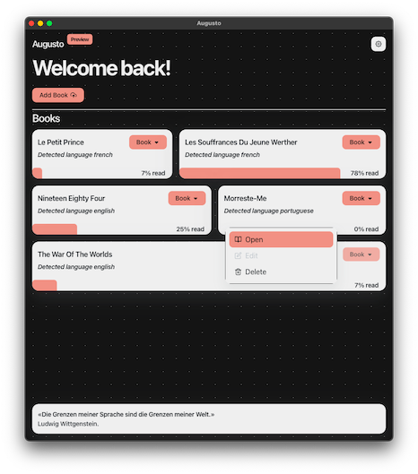

# **Augusto**
✝︎ *In memory of Antonio Augusto da Costa Silva Cardoso (Portugal 1946, Brazil 2018)*



Augusto is the result of a great effort, but yet a compilation of several open source tools, feel free to use Augusto as your will.

## **Local set up**
```
git clone https://github.com/woistkeller/augusto.git
```
```
cd augusto
```
```
npm i --force && npm run start
```
> *For Packagers and Makers, visit [ElectronForge Docs](https://www.electronforge.io/) (This current version is not ready to be compiled for Windows, Linux is not yet tested, sorry).*

However, if you want to try this
```
npm run package 
```
will try packages the app and
```
npm run make
```
will try create a distributable into the configurated makers.

> Thanks Jude, for helping me choose the accent color